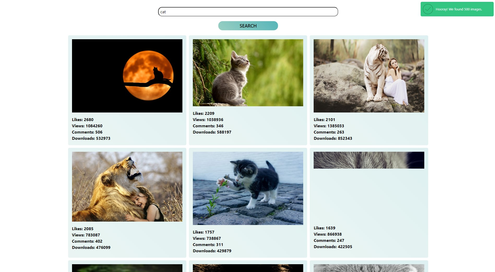

# Web application for image search.

## The project is based on Parcel.

#### Adaptive design to mobile, table, desktop.

#### Created a front-end part of the application for searching and viewing images by keyword word.

#### The public API of the Pixabay service is used as a backend.

#### In each response, 40 objects come from the backend.

#### There is a "Load More" button, when clicked, the request is executed for next group of images and add markup to existing elements galleries. It appears after the first render.

#### If the user has reached the end of the collection, the button disappears and appears notification with the text "We're sorry, but you've reached the end of search results.

#### Each photo has a brief information.

#### When you click on the image, the user throws a larger image into a new window.

